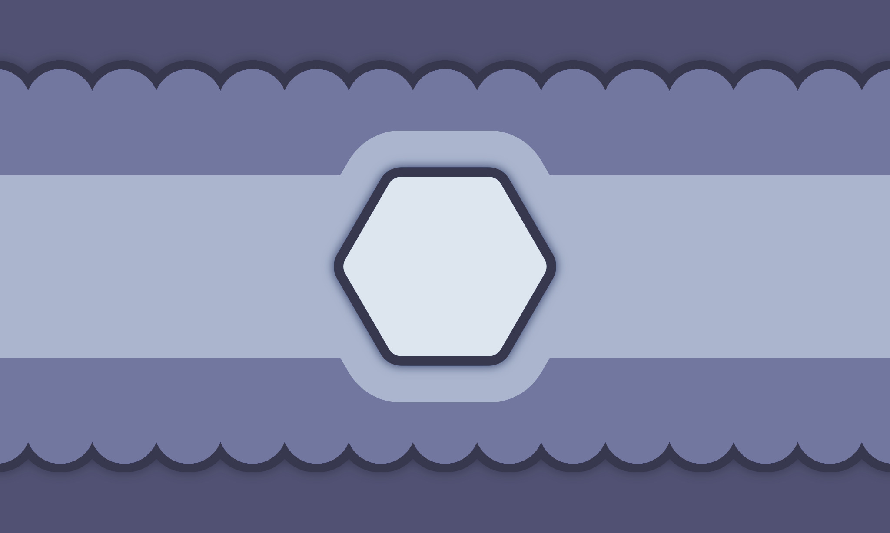

---
tags:
  - occuden
  - role
  - occupation
  - alterhuman
aliases: 
---
  
an identity based on an occupation / job-like role, fictional or real. examples include architects, scholars, scientists and marauders (c:aoa). this identity strongly influences the user & one's identification with the occupation may feel like a bigger part of one's identity than with the average experience someone with the occupation normally has. it is an alterhuman identity that isn't necessarily based in nonhumanity.