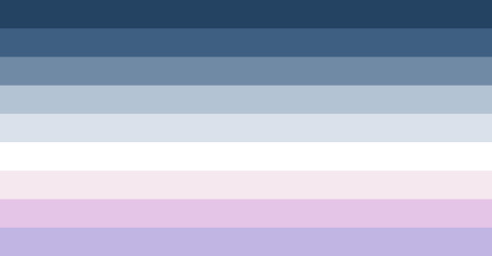

---
tags:
  - boy
  - aboyic
  - gender
  - masc
  - masculine
aliases: 
---
  
aboyic is when one feels a connection to boyhood, the ideas of being a boy and feels euphoric being called / perceived as a boy, yet does not identify as a man or a guy, their gender may feel more nonbinary, or xenic, or anything else-but if one's gender feels tied to an idea of boyhood and boyish masculinity it can be aboyic-and aboyic can be used as a suffix. "aboyic nonbinary" for example. it can also be used independently!