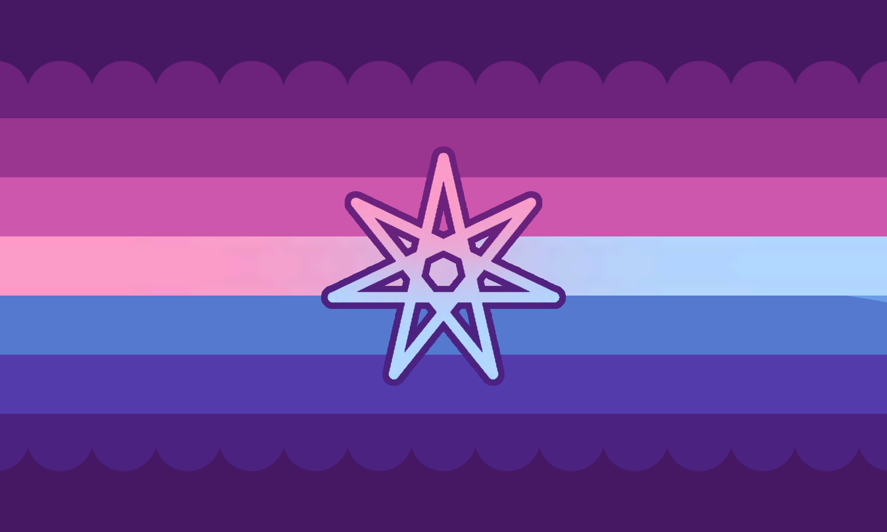

---
tags:
  - boygirl
  - kingender
  - mascfem
  - femmasc
  - girlboy
  - gender
  - genderkin
  - alterhuman_gender
aliases:
  - girlboykin
---
  
a gender that feels influenced by one’s kintype; being a [girlboy / boygirl](obsidian://open?vault=hoard&file=genders%20%26%20gender%20alignments%2Fgenders%2Fboygirl) as a result of one’s kintype, or being a [girlboy / boygirl](obsidian://open?vault=hoard&file=genders%20%26%20gender%20alignments%2Fgenders%2Fboygirl) in a distinctly kin-related way. 