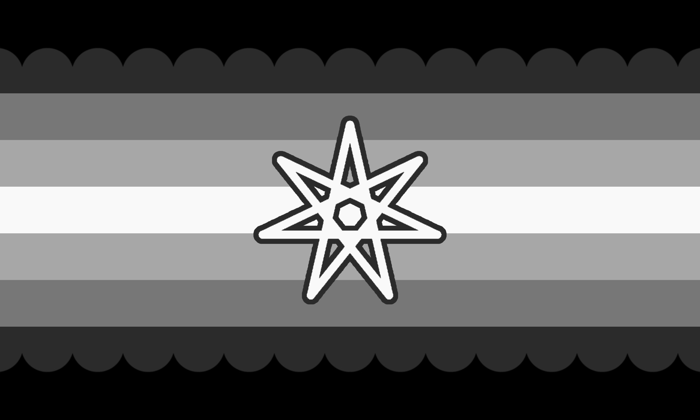

---
tags:
  - kingender
  - gender
  - genderkin
  - umbrella_term
  - alterhuman_gender
aliases: 
---
  
a gender that feels influenced by one’s kintype; being a gender as a result of one’s kintype, or being a gender in a distinctly kin-related way. 