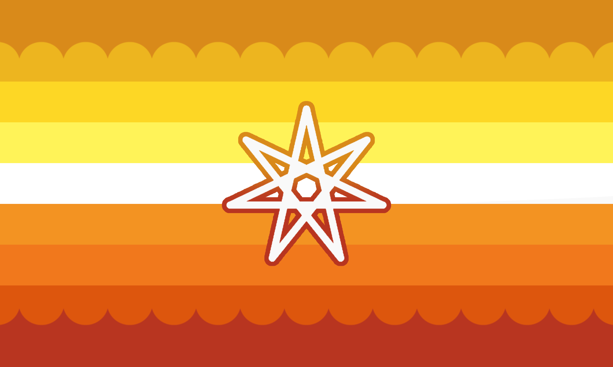

---
tags:
  - kingender
  - gender
  - genderkin
  - maverique
  - alterhuman_gender
aliases: 
---
  
a gender that feels influenced by one’s kintype; being [maverique](../../maverique.md) as a result of one’s kintype, or being [maverique](../../maverique.md) in a distinctly kin-related way.