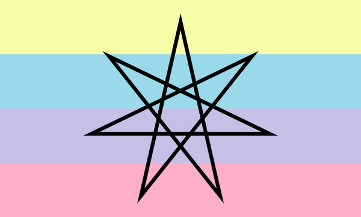

---
tags:
  - kingender
  - umbrella_term
  - gender
  - alterhuman_gender
aliases: 
---
  
**Kingender** is a [gender](https://mogai.miraheze.org/wiki/Gender "Gender") identity and umbrella term used to describe someone whose experience of gender is related to or influenced by their kintype.