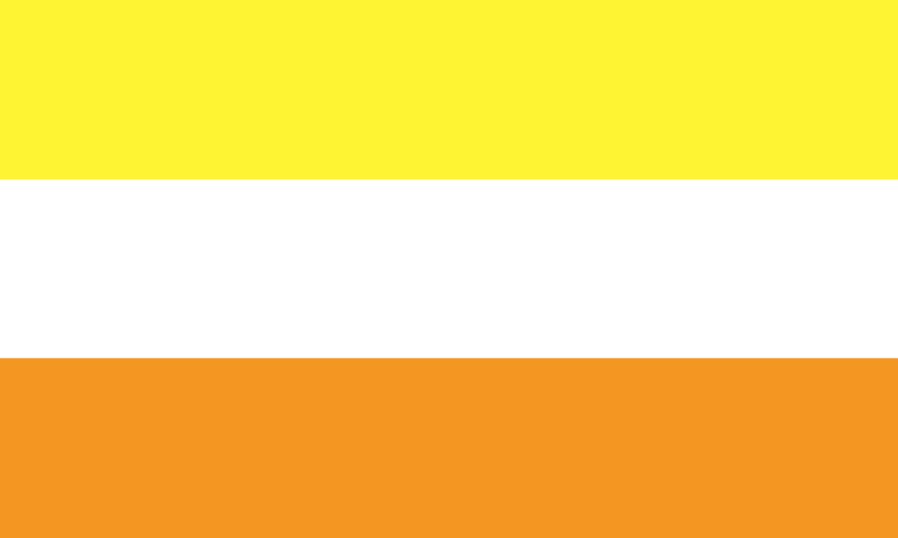

---
tags:
  - maverique
  - gender
  - non-trinary
aliases: 
---
  
a [non-binary](https://lgbtqia.wiki/wiki/Non-Binary "Non-Binary") gender that is defined as being completely independent from [male](https://lgbtqia.wiki/wiki/Male "Male"), [female](https://lgbtqia.wiki/wiki/Female "Female"), [masculine](https://lgbtqia.wiki/wiki/Masculine "Masculine"), [feminine](https://lgbtqia.wiki/wiki/Feminine "Feminine"), [neutral](https://lgbtqia.wiki/wiki/Neutral "Neutral"), [xenic](https://lgbtqia.wiki/wiki/Xenic "Xenic") or anything in between or derived from any of them. It is also not a lack of gender.