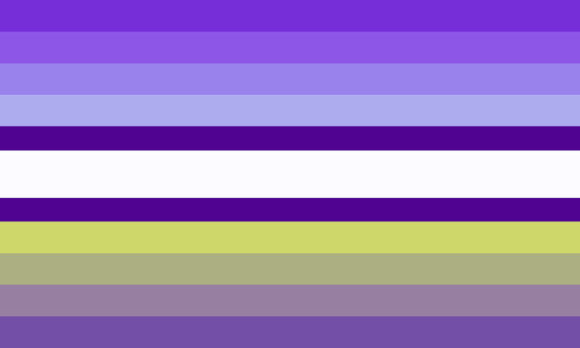

---
tags:
  - boygirl
  - girlboy
  - thing
  - mascfem
  - femmasc
  - gender
  - xenine
aliases:
  - girlboything
---
  
**Boygirlthing** is a [xenogender](./xenogender.md) [identity](https://gender.fandom.com/wiki/Identity "Identity") in which one's [gender](https://gender.fandom.com/wiki/Gender "Gender") is connected to being a [boy](https://gender.fandom.com/wiki/Boy "Boy"), a [girl](https://gender.fandom.com/wiki/Girl "Girl"), and a thing; a boygirlthing.