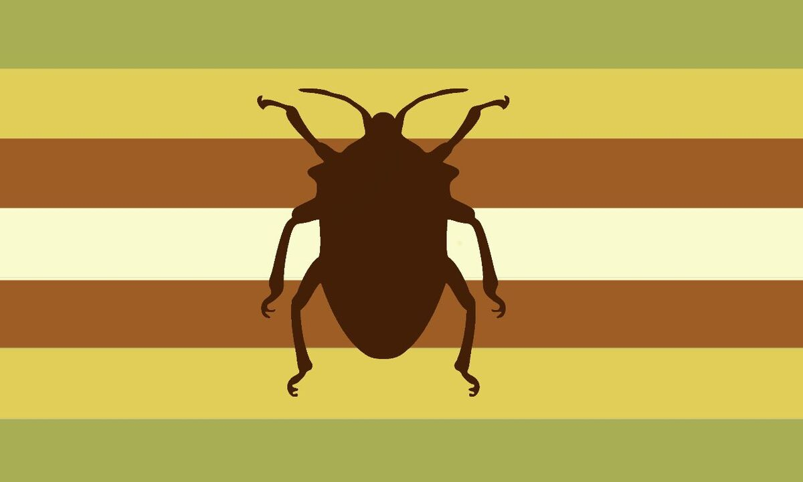

---
tags:
  - non-trinary
  - nontriaspec
  - non-trinary_spectrum
  - bug
  - gender
  - xenogender
  - xenine
  - buggender
  - animal
aliases: 
---
  
a [xenogender](./xenogender.md) [identity](https://gender.fandom.com/wiki/Identity "Identity") in which one's gender is connected to bugs.