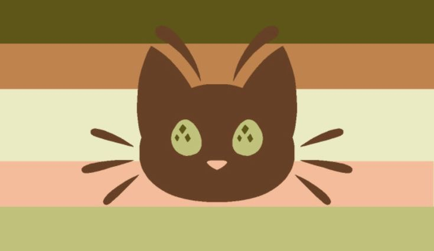

---
tags:
  - bug
  - cat
  - catgender
  - buggender
  - xenogender
  - xenine
  - nontriaspec
  - non-trinary
  - non-trinary_spectrum
  - animal
aliases:
  - catbuggender
---
  
a [buggender](../buggender.md) and [catgender](./catgender.md) in which one's gender is connected to cats and bugs / bugcats / catbugs