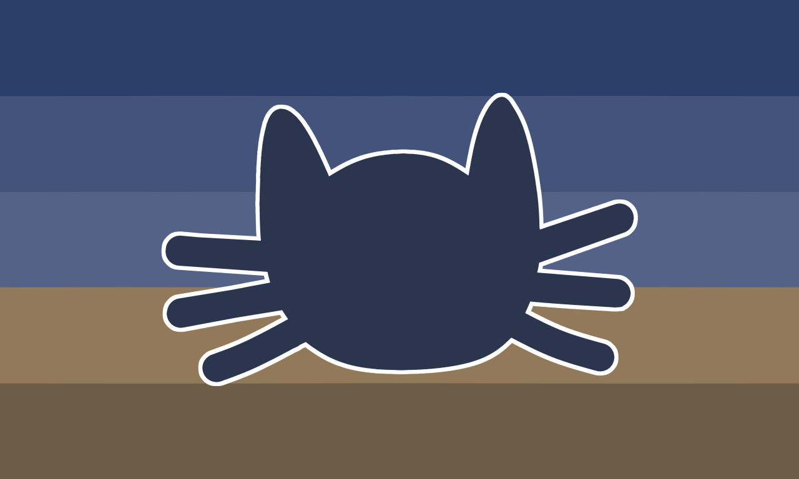

---
tags:
  - cat
  - gender
  - xenogender
  - animal
  - feline
  - non-trinary
  - catgender
  - xenine
  - nontriaspec
  - non-trinary_spectrum
  - inrainic
  - rain
aliases: 
---
  
an inrainic variant of [catgender](./catgender.md). a catgender connected to dark rainy days, sitting inside a warm house and watching rain on the window glass.