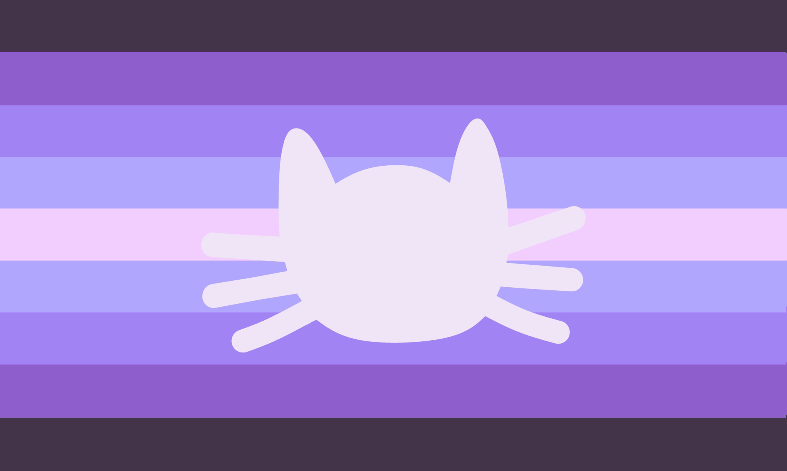

---
tags:
  - cat
  - animal
  - catgender
  - reidrovex
  - gender
  - non-trinary
  - non-trinary_spectrum
  - nontriaspec
aliases:
  - reidrokitty
---
  
a gender([catgender](./catgender.md)) related to [reidrovex](../../../../umbrellas/reidrovex.md) and cats, being [reidrovex](../../../../umbrellas/reidrovex.md) and liking cats, being a [reidrovex](../../../../umbrellas/reidrovex.md) cat, and/or anything else related to [reidrovex](../../../../umbrellas/reidrovex.md) and cats. 