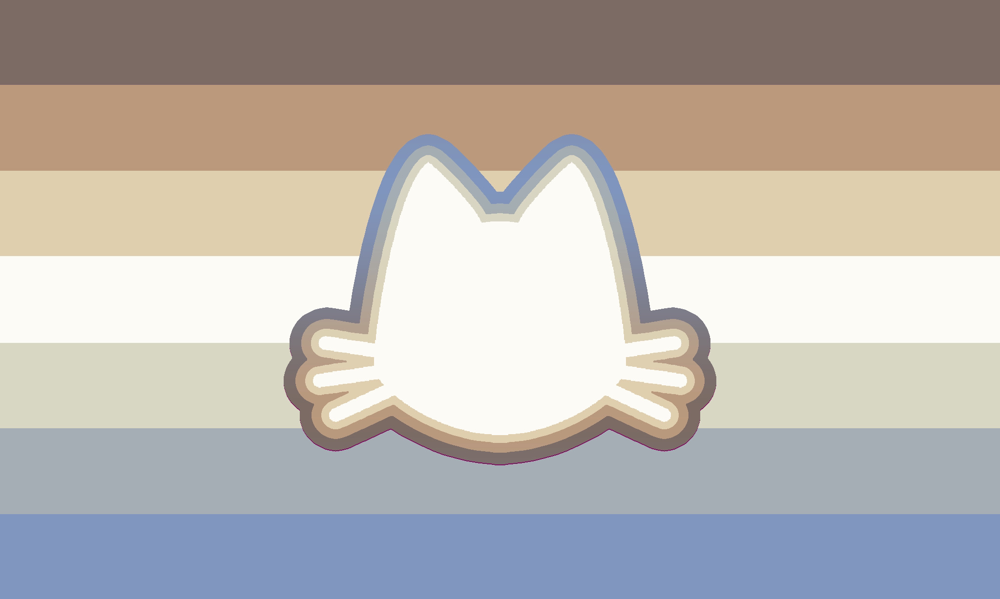

---
tags:
  - xenine
  - xenogender
  - non-trinary
  - nontriaspec
  - non-trinary_spectrum
  - cat
  - animal
  - silly
  - gender
aliases: 
---
  
a [xenogender](./xenogender.md) connected to cats  &&  silliness.  This may be interpreted as  (being)  a silly person with a cat,  a cat who is silly,  a person and their cat being silly,  a person who is a silly cat,  and/or whatever the user deems fit.  This term may be used as a [alterhuman](../../../alterhuman/alterhuman.md)/[nonhuman](../../../alterhuman/nonhuman/nonhuman.md)/[otherkin](../../../alterhuman/otherkin%20,%20therian/otherkin.md)/[therian](../../../alterhuman/otherkin%20,%20therian/therian.md) term,  as well as neurodivergent,  but that is fully up to the user to do  (or not).