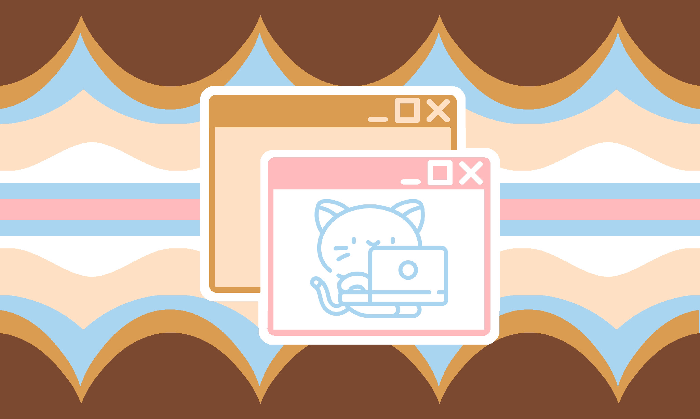

---
tags:
  - gender
  - xenogender
  - digital
  - virtual
  - genderdigital
  - gendervirtual
  - xenine
  - non-trinary
  - nontriaspec
  - non-trinary_spectrum
  - cat
  - animal
aliases:
  - catvirtual
---
  
a gender under [genderdigital](./genderdigital.md)(otherwise known as gendervirtual) in which your gender is related to virtual / digital themes and cats, being a virtual / digital cat, being a cat and loving virtual / digital themes, being a virtual / digital being who loves cat themes, etc