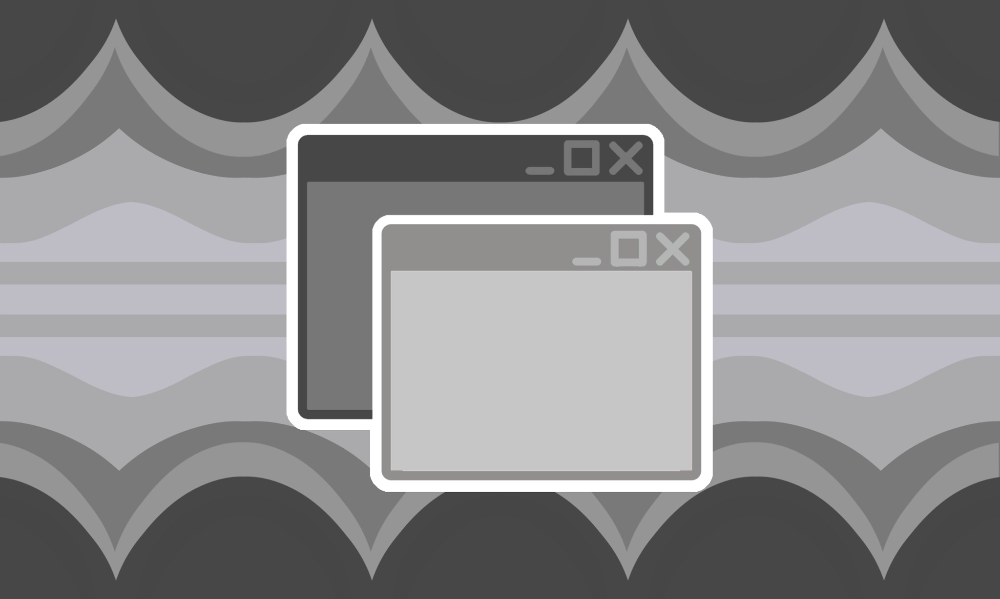

---
tags:
  - genderdigital
  - gendervirtual
  - digital
  - gender
  - virtual
  - xenogender
  - umbrella_term
  - gender_system
  - xenine
  - non-trinary
  - nontriaspec
  - non-trinary_spectrum
aliases:
  - gendervirtual
---
  
a gendersystem in which your gender is related to virtual / digital themes and x , such as being a virtual / digital x , a x who loves virtual s digital themes , a virtual / digital being who loves x themes , etc ~ !