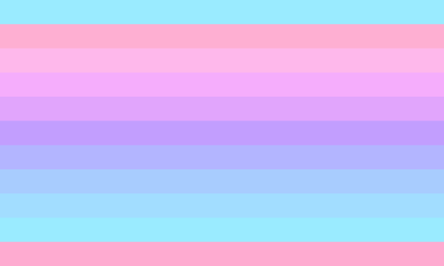

---
tags:
  - transgender
  - mascfem
  - femmasc
  - trans
  - transition_alignment
aliases:
  - transfemmasc
  - transfemasc
  - tmascfem
  - tfemasc
  - tfemmasc
---
  
**Transmascfem**, **transfemasc**, or **transfemmasc** is a gender modality for a transgender individuals who identify more with femininity and masculinity than neutrality. It is also a term for [multitransitional](https://community.fandom.com/wiki/w:c:gender:multitransitional "wikia:gender:multitransitional") individuals who are [both](https://lgbtqia.wiki/wiki/Both "Both") [transfeminine](https://lgbtqia.wiki/wiki/Transfeminine "Transfeminine") and [transmasculine](https://lgbtqia.wiki/wiki/Transmasculine "Transmasculine").