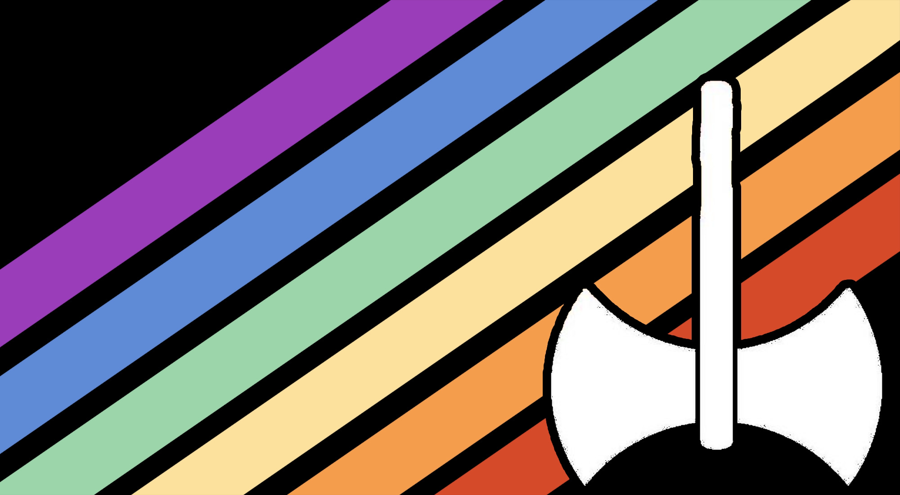

---
tags:
  - boy
  - masc
  - masculine
  - dyke
  - slurs
aliases: 
---
a combination of [boy](https://lgbtqia.wiki/wiki/Male "Male") and the derogatory term [dyke](https://lgbtqia.wiki/wiki/Dyke "Dyke"). It is commonly reclaimed by [lesboy](./lesboy.md)s and [butch](https://lgbtqia.wiki/wiki/Butch "Butch") [lesbians](https://lgbtqia.wiki/wiki/Lesbian "Lesbian"), however, it may be used by anyone who is a boy and reclaims the term dyke