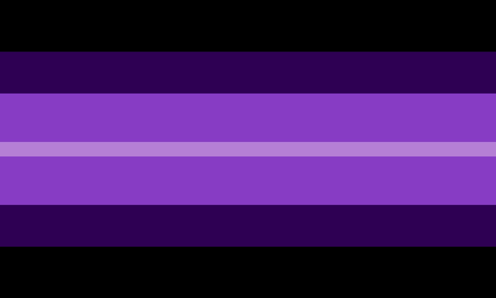

---
tags:
  - kenochoric
  - umbrella_term
  - neoumbrella
  - xenine
  - gender
  - non-trinary
  - nontriaspec
  - non-trinary_spectrum
aliases: 
---
  
Kenochoric refers to a gender that is centered around the idea of kenopsia *(The eerie, forlorn atmosphere of a place that's usually bustling with people but is now abandoned and quiet)*. It is usually, but not always, a xenogender and an aesthetigender. Depending on the person, it may also be a neurogender. Kenochoric is an umbrella term, but may be used as a gender on it’s own as well.  