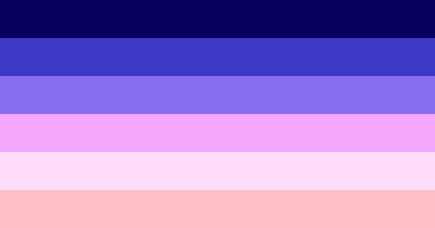

---
tags:
  - umbrella_term
  - sleep
  - sleepy
  - dream
  - drowsy
aliases: 
---
  
soporine is originally a gender quality (like masculine and feminine) based on sleepiness (or lack thereof), dreams, drowsyness, sleep, and aesthetics/themes surrounding these  
it is now an umbrella term and can be combined with many genders, qualities, alignments, etc. 